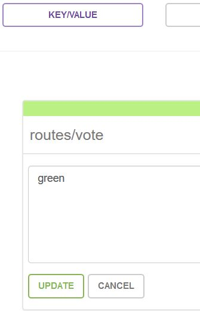

The python application used in the demo ("vote") is derived from the docker [example-voting-vote](https://github.com/docker/example-voting-app). Many thanks to them!

## How to use the code from this demo

### Build the vote application image and test it
```
docker build -t demotiad/vote:0.1 --build-arg version=0.1 docker/vote
docker tag demotiad/vote:0.1 demotiad/vote:latest
```
You can have a look at the image metadata
```
docker inspect --format='{{json .ContainerConfig.Labels}}'  demotiad/vote:0.1 | jq .
docker run --rm demotiad/vote:0.1 cat /Dockerfile
```
Start the application
```
docker-compose -f docker/simple-compose.yml up
```
This compose file simply starts the vote application and a redis container. You can now connect to the application in your browser ([http://localhost:8080](http://localhost:8080))


There is another compose file which mounts the docker directory to allow live edit of the python code (devsimple-compose.yml).

Destroy the containers
```
docker-compose -f docker/simple-compose.yml down
```

## How to deploy this demo to AWS

### Set AWS config
Create ssh keypair
```
ssh-keygen -t rsa -b 2048 -f ~/.ssh/id_rsa.tiad
```

Set AWS env
```
export AWS_ACCESS_KEY_ID="<your access key>"
export AWS_SECRET_ACCESS_KEY="<your secret key>"
export AWS_DEFAULT_REGION="<region>"
```

Set Terraform config
```
Edit "terraform/common/terraform.tfvars"
Update for your config:
    region = "eu-central-1"
    cidr_block = "10.40.0.0/16"

Edit "terraform/common/backend.tf"
Update for your config:
    bucket = "tiad-tfstate"
    region = "eu-central-1"
```

Note: all terraform stack will be initialized with 'init' script (instead of 'terraform init' command)


### Create repo with terraform
In terraform/repo
```
./init
terraform apply
```

### Build containers and upload images to repo
```
# Get repo url
cd terraform/repo
vote=$(terraform output ecr_vote_url)
dynnginx=$(terraform output ecr_dynnginx_url)
dynhaproxy=$(terraform output ecr_dynhaproxy_url)
cd -

# Build images
docker build -t demotiad/vote:0.1 --build-arg version=0.1 vote
docker build -t demotiad/dynnginx dynnginx
docker build -t demotiad/dynhaproxy dynhaproxy

# Tag images
docker tag demotiad/vote:0.1 demotiad/vote:latest
docker tag demotiad/vote:0.1 ${vote}:0.1
docker tag demotiad/vote:latest ${vote}:latest
docker tag demotiad/dynnginx:latest ${dynnginx}:latest
docker tag demotiad/dynhaproxy:latest ${dynhaproxy}:latest

# Push images to repo
$(aws ecr get-login | sed "s/-e none//")
docker push ${vote}:0.1
docker push ${vote}:latest
docker push ${dynnginx}:latest
docker push ${dynhaproxy}:latest
```

### Create VPC
In terraform/vpc
```
./init
terraform apply
```

### Create Consul AMI
In packer/consul-server/
```
# Get VPC & public Subnet to use with packer
cd ../../terraform/vpc
VPC_ID=$(terraform output vpc_id)
SUBNET_ID=$(terraform output public_subnets |tail -n 1)
cd -

# Build AMI
packer build -var-file=debian.params.json consul.json
```

### Build Consul cluster
In terraform/consul
```
./init
terraform apply
```


To connect to the conul UI we need to tunnel through the bastion (adapt with your public zone or use the bastion IP)
```
ssh -i ~/.ssh/id_rsa.tiad admin@<bastion IP> -L 8500:consulagent:8500
```
The consul UI is now available at [http://localhost:8500](http://localhost:8500)


### Build ECS cluster
In terraform/ecs
```
./init
terraform apply
```

### Deploy backends
In terraform/app/backends
```
./init
terraform apply
```

Check vote_url UI (output of backends)

### Deploy Blue & Green frontends
In terraform/app/frontends/blue
```
./init
terraform apply
```
In terraform/app/frontends/green
```
./init
terraform apply
```

Refresh vote_url, the app is deployed

## How to play with demo

### Switch Blue <-> Green
2 solutions:
```
Add following header in your browser (many plugins allow to modify header):
  - X-Color=blue
Or
  - X-Color=green
```

```
Add routes/vote key value in consul set to "blue" or "green"
```


### Modify & Deploy new app version
```
# Update docker/vote/templates/index.html then

cd terraform/repo
vote=$(terraform output ecr_vote_url)
cd -

# Build images
docker build -t demotiad/vote:0.2 --build-arg version=0.2 docker/vote

# Tag images
docker tag demotiad/vote:0.2 demotiad/vote:latest
docker tag demotiad/vote:0.2 ${vote}:0.2
docker tag demotiad/vote:latest ${vote}:latest

# Push images to repo
$(aws ecr get-login | sed "s/-e none//")
docker push ${vote}:0.2
docker push ${vote}:latest
```

### Upgrade Green
In terraform/app/frontends/green
```
terraform apply
```

### Switch frontend and see new version

